# Vulnex

> Open-source pentest workbench — engagement → recon → findings → review → PDF report → retest, in a single Django app.

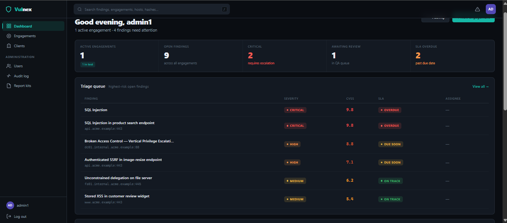

[](LICENSE)
[](https://www.python.org/downloads/)
[](https://www.djangoproject.com/)
[](https://docs.docker.com/compose/)

## What it is

Most open-source tools in this space are one slice — reporting (Dradis, PwnDoc) or vulnerability databases (DefectDojo). Vulnex is the full loop in one app:

- **End-to-end workflow** — engagement → recon → methodology checklists → findings → peer review → PDF report → retest tracking.
- **Scanner-agnostic ingestion** — Nuclei, Nikto, Burp, Nessus, ZAP, Semgrep, Nmap XML, plus CSV bulk import. Automatic dedup against existing findings.
- **Hardened by default** — TOTP MFA, login lockout, CSP, encrypted credential vault with a dedicated `VAULT_MASTER_KEY`, authenticated evidence downloads, full audit log.
- **Red-team aware** — Kill-chain diagram editor on red-team engagements (a small DAG you draw to narrate the path you walked, embedded in the PDF). Not a BloodHound replacement — narrative, not enumeration.
- **Scriptable** — every UI capability is also exposed via a DRF REST API with OpenAPI docs and per-user API keys.

## Why I built this

I kept ending up in the same gap on engagements: scanner output lived in CSVs, reporting lived in a Word template, methodology coverage lived in a spreadsheet, and credentials lived in `secrets.txt`. The "real" tools were either commercial-tier expensive (PlexTrac, Faraday Pro), or single-purpose (Dradis for reports, DefectDojo for tracking). Vulnex is what I wanted on my own engagements — one workspace where the whole loop lives, with security defaults that don't embarrass a pentester running it.

## Quick start

```bash
git clone https://github.com/jawad-salem/Vulnex.git
cd Vulnex
cp .env.example .env && docker compose up --build
```

Open <http://localhost:8000> after `web` finishes boot. The entrypoint migrates, collects static, seeds finding templates and OWASP methodology checklists, bootstraps a superuser if one doesn't exist, and (when `SEED_DEMO=1`, the default) populates a full demo client with two engagements, eight findings across every severity, evidence, recon hosts, an attack-path DAG, an activity log, and one generated PDF.

### Demo accounts

| Username | Password | Role |
|---|---|---|
| `admin` | `admin1` | Bootstrap superuser |
| `demo-admin` | `demo-password` | Platform admin |
| `demo-pentester` | `demo-password` | Engagement lead + pentester |
| `demo-reviewer` | `demo-password` | Reviewer |
| `demo-client` | `demo-password` | Read-only client |

> The shipped `.env.example` runs with `DJANGO_DEBUG=True` and a known-bad `DJANGO_SECRET_KEY` so a fresh clone boots without configuration. Rotate every secret before exposing the instance to the public internet.

## Feature tour

### Dashboard
Risk score, active-engagement and finding counts, SLA-overdue and "assigned to me" widgets, severity/status charts, and an urgent-findings table.


### Client overview
Per-client rollup — findings by severity, SLA status, and every engagement for that client.

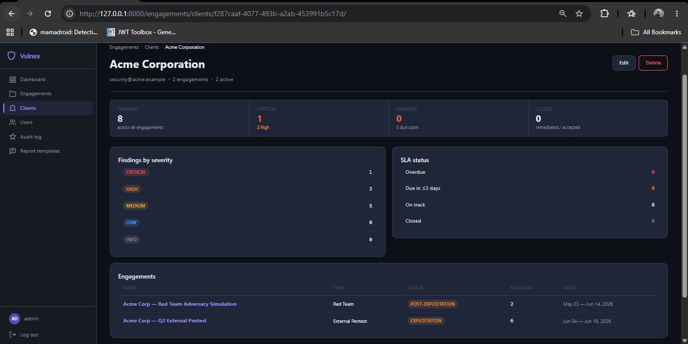

### Engagement setup
Create an engagement with type, status, scope, and rules of engagement.

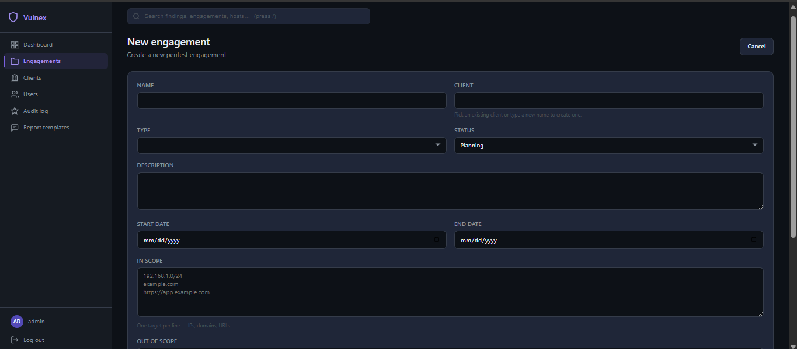

### Reconnaissance
Built-in scanners (port, subdomain, tech, DNS, dirbrute) with single or chained multi-scan, Celery-backed scheduling, discovered-host tracking, and Nmap XML import.

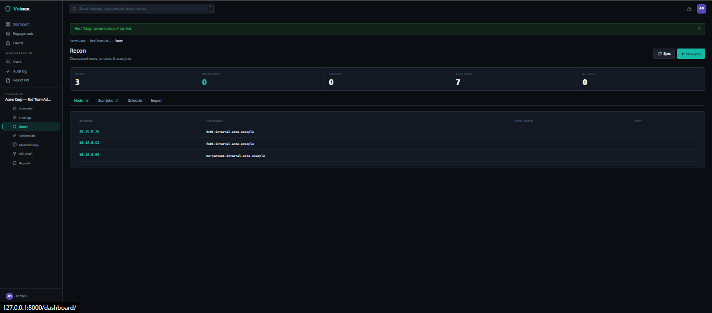

### Methodology checklist
OWASP WSTG-seeded checklists with per-engagement progress tracking and status dropdowns.

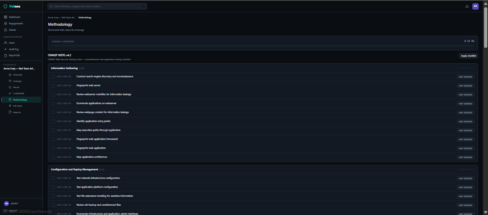

### Findings list
Severity chips, CVSS, review-state badges, SLA due dates, severity/status/assignee filters, dedup-aware import, and CSV/JSON export.

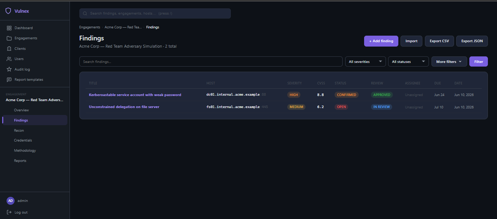

### Finding detail
Severity and CVSS, review/approval workflow, SLA, retest tracking, evidence, threaded comments, and structured location — organised across tabs.

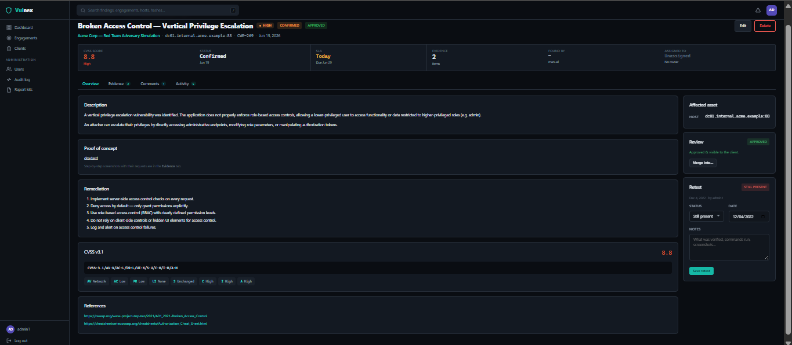

### Evidence
Authenticated evidence uploads per finding, plus Markdown-supported threaded comments (internal-only or client-visible).

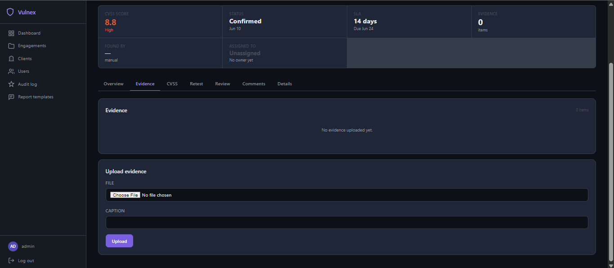

### Kill-chain diagram (red-team)
DAG editor — entrypoints, hosts, identities, assets, objectives connected by techniques with optional ATT&CK IDs. Embedded into the technical PDF.

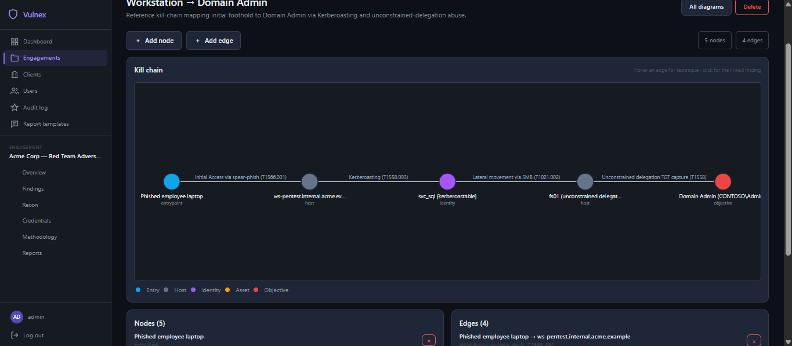

### Report templates
Brand kits for generated PDFs — logo, colours, boilerplate, and per-client default templates.

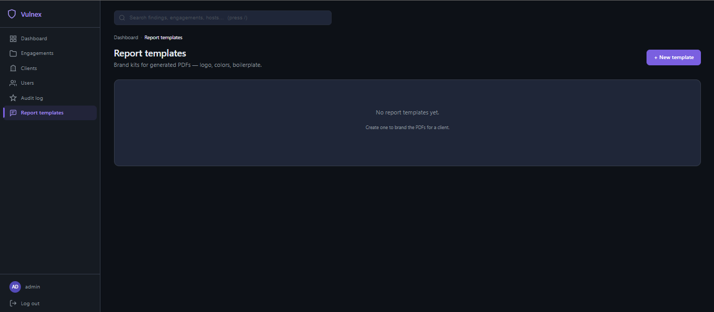

### Users & roles
Role-based access — admin, pentester, reviewer, client — with per-engagement membership.

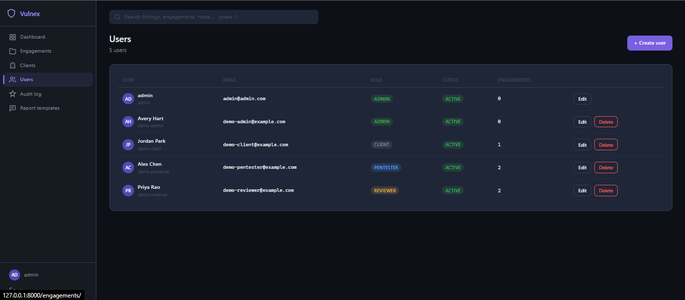

### Audit log
Append-only record of admin actions and security events — logins, MFA changes, report generation, user creation.

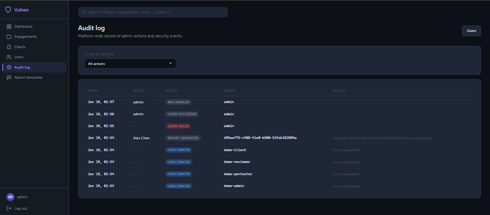

## Architecture

Vulnex is a vanilla Django 5 app with one Postgres database, Redis as the Celery broker, and a single Gunicorn web service. Each domain lives in its own app: `accounts` (auth, MFA, audit log), `engagements` (scope, members, attack paths), `vulns` (findings, evidence, comments, imports), `recon` (scanners, hosts, scheduled scans), `methodology` (checklists), `reports` (templates, PDF generator), `credentials` (Fernet vault), `api` (DRF). HTML is server-rendered with a small amount of vanilla JS for live widgets (CVSS calculator, attack-path SVG renderer, Markdown preview); no SPA framework. Long-running work — recon scans and retest reminders — runs in Celery workers backed by Redis.

For the request lifecycle, data model, report-generation pipeline, web-vs-API auth split, and deployment topologies, see [`docs/ARCHITECTURE.md`](docs/ARCHITECTURE.md).

## REST API

`/api/v1/` covers engagements, findings, evidence, hosts, credentials (vault reveal gated identically to the UI), and reports. Authenticate with a per-user **API key** (issue/revoke from the profile page; only the prefix is stored) or a **JWT** for SPA clients. Permissions reuse the same role decorators as the UI. Throttled to 1000 req/hr/user.

- **OpenAPI schema** — `/api/schema/`
- **Swagger UI** — `/api/docs/`
- **Endpoint reference** — [`docs/API.md`](docs/API.md)

## Tech stack

- **Backend** — Django 5.x, Python 3.12 (Docker image) / 3.11+ supported.
- **Database** — Postgres 16 (Docker default); SQLite supported for dev. Postgres unlocks FTS-ranked global search.
- **API** — Django REST Framework, SimpleJWT, drf-spectacular.
- **Async** — Celery 5 + Redis 7 for recon scans and scheduled jobs.
- **Auth & security** — `django-otp` (TOTP), `django-axes` (lockout), `django-csp`, `cryptography` (Fernet vault).
- **Reporting** — ReportLab for PDF; Markdown bodies sanitised with `bleach`.
- **Frontend** — Server-rendered Django templates, custom dark CSS, Chart.js (CSP-allowlisted), vanilla SVG for the attack-path graph.
- **Containers** — Multi-stage Dockerfile, non-root `vulnex` user, Compose stack with healthchecks.

## Known limitations

- **Single-tenant.** Roles and per-engagement membership scope visibility within one deployment; there is no organisation/tenant boundary above that.
- **Web only.** No mobile or native client.
- **No compliance-framework auto-mapping** (PCI / ISO / NIST / SOC 2 control linkage on findings is not implemented).
- **No agent-based recon.** Scanners run from the Vulnex host; there is no installable endpoint agent.
- **Red-team scope is intentionally lightweight.** The kill-chain diagram is a *report artifact* — a 5–10 node DAG you draw by hand to narrate one path you walked. BloodHound-style AD enumeration, automated path-finding, C2 integration, and live session management are out of scope.
- **No production-grade Jira / GitHub Issues sync** yet — see roadmap.

## Roadmap

Highlights of what's still open:

- **OWASP Top 10 + MITRE ATT&CK tagging** (1.1) — taxonomy fields with chips, filters, and PDF rendering.
- **DOCX export + report versioning** (1.2) — Word output and per-regeneration version history.
- **Bulk actions, kanban, keyboard shortcuts** on the findings list (1.3).
- **Real recon execution** via nmap / httpx / nuclei subprocess workers (1.4).
- **In-app notifications + GitHub Issues sync + reversible merge** (1.6 / 1.7 / 1.10).
- **Methodology ↔ findings two-way coverage, CVSS v4** (1.8 / 1.9).
- **Stretch:** client portal, Google OIDC, outbound webhooks (2.1 / 2.2 / 2.3).

## Contributing

Bug reports, ideas, and pull requests are welcome — open an issue or a PR. See [Local development](#local-development-no-docker) below for setup. Please report security issues privately rather than in a public issue.

### Local development (no Docker)

```bash
python -m venv .venv
source .venv/bin/activate          # Linux/Mac
.venv\Scripts\activate              # Windows

pip install -r requirements.txt
cp .env.example .env

python manage.py migrate
python manage.py seed_templates
python manage.py seed_methodologies
python manage.py seed_demo          # optional: demo client, engagements, findings, and demo-* accounts
python manage.py createsuperuser
python manage.py runserver
```

### Running the tests

```bash
python manage.py test
python manage.py check --deploy
```

## Project structure

```
Vulnex/
├── accounts/        # User model, MFA, audit log, API keys
├── api/             # DRF endpoints, serializers, permissions
├── credentials/     # Fernet-encrypted credential vault
├── dashboard/       # Home dashboard, charts, global search
├── engagements/     # Engagement CRUD, members, attack paths
├── methodology/     # Checklists and progress tracking
├── recon/           # Scanners, scheduled scans, hosts
├── reports/         # Report templates + ReportLab generator
├── vulns/           # Findings, evidence, comments, imports
├── vulnex/          # Settings, URLs, Celery
├── templates/       # Server-rendered HTML
├── static/          # Dark CSS, vendored JS
├── docs/            # API reference, screenshots
├── Dockerfile
├── docker-compose.yml
└── entrypoint.sh
```

## Environment variables

| Variable | Default | Description |
|---|---|---|
| `DJANGO_SECRET_KEY` | dev key | Django secret key. **Rotate before deploying.** |
| `DJANGO_DEBUG` | `True` | Debug mode. Flip to `False` in any deployment a stranger can reach. |
| `DJANGO_ALLOWED_HOSTS` | `localhost,127.0.0.1` | Comma-separated host allowlist. |
| `DJANGO_USE_HTTPS` | `False` | Enables HSTS and `Secure` cookies when `True`. |
| `DATABASE_URL` | (compose injects Postgres) | Database URL; SQLite if unset. |
| `VAULT_MASTER_KEY` | — | **Required in production.** Fernet key (44-char base64) for the credential vault. |
| `SITE_URL` | `http://localhost:8000` | Base URL for invitation links. |
| `SEED_DEMO` | `1` | Run `seed_demo` on first boot. Set to `0` for a clean install. |
| `DJANGO_BOOTSTRAP_USERNAME` / `_PASSWORD` / `_EMAIL` | `admin` / `admin1` / `admin@example.com` | Superuser created on first boot if no superuser exists. |
| `EMAIL_BACKEND` | Console | Email backend. SMTP works out of the box; see `.env.example`. |

## License

[MIT](LICENSE).
