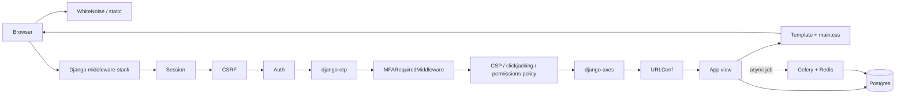
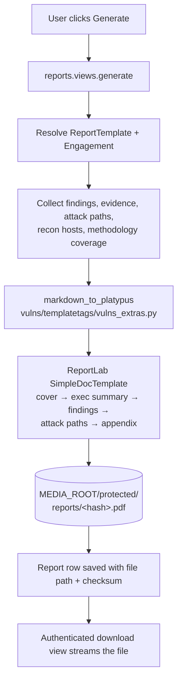

# Vulnex Architecture

A one-pager for anyone reading the code for the first time. The goal is to explain *why the project is laid out this way* and what happens on the most important request paths. Every claim here points at real code — when reality and this doc disagree, reality wins.

## Why server-rendered Django

Vulnex is intentionally a single Django project, server-rendered, with a hand-rolled CSS file (`static/css/main.css`) and small vanilla-JS sprinkles. There is no frontend framework, no build step, no separate API gateway.

That choice exists because pentesting workflows are read-heavy, form-driven, and printable — a finding form, a methodology checklist, a report preview. Server rendering keeps the loop *engagement → finding → review → PDF* in one process, with one auth model, one data store, and one deploy unit. The REST API is a parallel surface on top of the same models and querysets, not a separate service.

## App layout

```
vulnex/                    # Django project (settings, root URLs, Celery)
├── accounts/              # Custom User, MFA, audit log, API keys, role middleware
├── engagements/           # Client → Engagement → Members → Notes → Activity log
│                          # Attack-path DAG (path / node / edge) lives here too
├── vulns/                 # Findings, evidence, comments, finding templates,
│                          # scanner parsers (vulns/parsers.py) + import/merge
│                          # services (vulns/services/)
├── recon/                 # Recon scans, discovered hosts, scheduled scans, pipelines
├── credentials/           # Encrypted credentials vault (Fernet)
├── methodology/           # OWASP-style checklists scoped to engagements
├── reports/               # Report templates + ReportLab PDF generator
├── api/                   # DRF viewsets, OpenAPI schema, JWT + API-key auth
├── dashboard/             # Cross-app landing view + global search
├── templates/             # Server-rendered HTML (base.html owns layout + CSP nonces)
├── static/css/main.css    # Single hand-rolled stylesheet
└── docs/                  # API.md, ARCHITECTURE.md (this file), screenshots
```

One cross-cutting module lives at project level rather than in an app:

- `vulnex/celery.py` — the Celery app and task autodiscovery.

## Data model

The domain has six anchor tables; everything else hangs off them.

```
Client ───< Engagement ───< EngagementMember >─── User
              │                                      │
              ├─< Finding ───< Evidence              ├─< AuditLog
              │       └────< FindingComment          └─< APIKey
              ├─< AttackPath ──< AttackPathNode
              │           └───< AttackPathEdge
              ├─< DiscoveredHost ──< ReconScan
              ├─< Credential                     (Fernet-encrypted blob)
              ├─< EngagementChecklist >── ChecklistItem ── ChecklistCategory ── Methodology
              ├─< Report ───── ReportTemplate
              └─< ActivityLog
```

Notes worth knowing if you're reading the code:

- **`User` is custom** (`accounts.User`, `AbstractUser`). `User.role` is the source of truth for "what can this person do" outside an engagement (admin / engagement-lead / pentester / reviewer / client). `EngagementMember` is the per-engagement scoping layer on top of that.
- **`Finding`** carries the ATT&CK / OWASP fields, severity, CVSS, status, dedup key, and the rendered/sanitised Markdown body. Bulk imports parse scanner output in `vulns/parsers.py`, then the import service (`vulns/services/imports.py`) dedups and writes `Finding` rows; views just handle the upload/preview flow.
- **`AttackPath` / `AttackPathNode` / `AttackPathEdge`** form the kill-chain diagram — a small hand-drawn DAG (typically 5–10 nodes) the pentester sketches to narrate the path they walked, embedded in the PDF report. It is *not* a BloodHound-style enumeration engine, just a labelled diagram. Edges carry the ATT&CK technique tag and an optional finding link; the PDF generator walks the graph in BFS order.
- **`Credential.secret_encrypted`** is a single Fernet ciphertext column. The key comes from `VAULT_MASTER_KEY` — see `SECURITY.md` for rotation and the pre-1.2 SECRET_KEY-derived fallback.
- **`AuditLog`** is the append-only forensic trail for sensitive actions (login, role change, credential access, report download). It is never edited or deleted at the model layer.

## Request lifecycle

A typical authenticated page request:



The middleware order is load-bearing — see `vulnex/settings.py:48` for the canonical list. A few specifics:

- **`MFARequiredMiddleware`** redirects an authenticated user with a confirmed TOTP device but no verified session to the verification step. It does *not* force enrollment for users who never set up TOTP — that's policy.
- **`django-axes` is last on purpose** so failed logins from earlier middleware are still observed for lockout.
- **CSP nonces** are emitted by `csp.middleware.CSPMiddleware` and consumed by every `<script nonce="{{ request.csp_nonce }}">` in `templates/base.html`. Adding inline JS without a nonce will silently break under CSP.

## Authentication: web vs. API

Two parallel auth surfaces, one user table:

| Surface | Identity | Sessions | MFA | Where |
| --- | --- | --- | --- | --- |
| Web UI | username + password | Django session cookie | TOTP via django-otp; lockout via django-axes | `accounts/views.py`, `MFARequiredMiddleware` |
| REST API | JWT (preferred) or API key | Stateless | Inherited from issuing user's role/scope | `api/`, `rest_framework_simplejwt`, `accounts.APIKey` |

API requests resolve to a `User` (via JWT subject or API-key lookup), and every viewset filters its queryset by the user's role and `EngagementMember` scope before serializing. There is no separate "API role" — the same role that gates the UI gates the API. See `docs/API.md` for the exact endpoints and auth examples.

## Report generation pipeline

PDF is the one place where the request path is genuinely heavy, so it has its own module (`reports/generator.py`) built on ReportLab.



A few non-obvious things:

- **Markdown → ReportLab.** Finding bodies are stored as Markdown, sanitized with `bleach`, and converted to ReportLab `Paragraph` flowables by `markdown_to_platypus`. This is why CSP and the PDF use the same sanitizer surface — anything that passes for the web view also passes for the PDF.
- **Severity colors are fixed.** Red means critical in every report. The `ReportTemplate` controls cover, header, and rule colors, but not severity chips — that's an intentional choice in `reports/generator.py`.
- **Output lives in protected media.** `MEDIA_ROOT` has a `protected/` subtree that is *not* served by WhiteNoise. Downloads go through an authenticated Django view that checks `EngagementMember` membership before streaming.

## Background work (Celery + Redis)

Recon scans are scheduled via `recon.ScheduledScan` and dispatched as Celery tasks. The scan runs in the worker, writes `DiscoveredHost` rows, and updates the scan record. The web app polls the scan's status field for the dashboard.

## Deployment shape

Two supported topologies, both running the same image:

- **Local Docker Compose** — `docker compose up`. Web (gunicorn) + db (postgres:16) + redis + celery worker + celery beat, all on a single network, with healthchecks and named volumes for static/media/protected-media/postgres.
- **Native** — `python manage.py runserver` against a host-installed Postgres + Redis. Used during development.

A GitHub Actions release workflow (`.github/workflows/release.yml`) publishes the Docker image to GHCR on a `v*` tag.

## Things this doc doesn't cover

- **Frontend interaction details** — read `templates/base.html` and `static/css/main.css`. The base template owns the sidebar, mobile toggle, toast handling, and keyboard shortcuts (`/`, `n`, `f`, `r`).
- **Per-app URL maps** — `<app>/urls.py` in each app. The root URLConf is `vulnex/urls.py`.
- **REST API surface** — `docs/API.md`, plus the live OpenAPI schema at `/api/schema/` and Swagger UI at `/api/docs/`.
- **Database migration history** — `<app>/migrations/`. There are no squashed migrations; every change is preserved.
